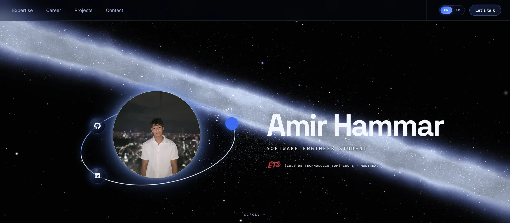

# Developer Portfolio

       

## What is this?

My personal portfolio, live at **[amir.com.co](https://amir.com.co)**. It showcases my career history, projects, and skills, set against an interactive 3D galaxy that the camera flies through as you scroll.



## Features

- **Three.js galaxy background.** The camera travels to a different spot for each section as you scroll (GSAP ScrollTrigger). If WebGL is missing or the GPU is a software renderer, it falls back to a static frame or a CSS background.
- **Scroll animations.** Sections fade and slide in as they enter the viewport, and the navigation scrolls smoothly between them.
- **Respects `prefers-reduced-motion`.** Animations and the camera flight turn off when reduced motion is requested.
- **English / French.** Built with i18next. The language is detected automatically and can be switched from the navigation bar.
- **Deep links to projects.** A link like `amir.com.co/?p=coeurSolidaire` scrolls straight to that project.
- **Like button and feedback reactions.** Counters are stored in a free public API (countapi), so no backend is needed. Requests time out after 6 s so a slow API never blocks the UI.
- **Project showcases.** Desktop/mobile, light/dark, and EN/FR screenshots, plus video, for projects like CanBankX and Coeur Solidaire.
- Responsive and mobile-friendly.

## Quick Setup

1. Install [Node.js](https://nodejs.org/) **20.19+ or 22.12+** (required by Vite).
2. Run `npm install`.
3. Open the project in VS Code and press **F5** (or click Run in the Run and Debug panel) with **"Run website (Chrome)"** selected. This starts the dev server and opens the site on [http://localhost:3000](http://localhost:3000).

Not using VS Code? Run `npm run dev` instead.

### Scripts

| Command | What it does |
| --- | --- |
| `npm run dev` | Vite dev server with hot reload on http://localhost:3000 |
| `npm start` | Alias for `npm run dev` |
| `npm run typecheck` | TypeScript check, no emit |
| `npm run lint` | ESLint over the project |
| `npm test` | Vitest in watch mode |
| `npm run test:ci` | Vitest, single run |
| `npm run build` | Typecheck, then production bundle into `build/` |
| `npm run preview` | Serve the built `build/` folder on http://localhost:5000 |
| `npm run deploy` | Build and publish to the `gh-pages` branch |

### Running from VS Code

Other configurations in `.vscode/launch.json` and `.vscode/tasks.json`:

- **"Run website (Edge)"** works the same as the Chrome configuration. Breakpoints in `src/` work in both.
- **"Preview production build"** builds and serves `build/` on port 5000.
- **"Debug tests (Vitest)"** runs the tests under the debugger.
- **Ctrl+Shift+B → "checks: all"** runs typecheck → lint → tests → build, which is everything that should pass before you push.

## Project structure

```
src/
├── App.tsx              # Section layout, deep-link scrolling, scroll-reveal animations
├── i18n.tsx             # All EN/FR text (roles, career, projects, skills…)
├── components/          # One component per section + project showcases
│   ├── GalaxyHero.tsx   # Canvas + scroll-driven camera flight
│   ├── MissionHud.tsx   # Like/star counter
│   ├── FeedbackReactions.tsx
│   └── Timeline/        # Career history
├── three/galaxyScene.ts # Three.js scene (stars, nebulae, GPU detection)
├── data/                # Skills list and project media manifests
├── hooks/               # useReducedMotion
└── assets/              # Images, videos, SCSS styles
```

To edit the content, change the text in `src/i18n.tsx` (in both `en` and `fr`), the skills in `src/data/skills.ts`, and the project images and videos in `src/assets/images/projects/`.

### Vite notes

- `index.html` is in the **project root**, not in `public/`. Vite uses it as the entry point and adds the bundled scripts to it at build time.
- `public/` is copied as-is to the output root. Reference those files with absolute paths (`/favicon.ico`), never `%PUBLIC_URL%`.
- Import images and videos as ES modules (`import logo from "../assets/images/logos/x.png"`) so Vite can hash and inline them. `require()` does not work.
- The build goes to `build/` instead of `dist/` (set in `vite.config.ts`), which is the folder the `gh-pages` deploy expects.
- `vite.config.ts` aliases `@mui/icons-material/*` to its ESM build to work around a CommonJS interop bug in MUI v5. Remove the alias after upgrading to MUI v6+.

## Deployment

The site is deployed to GitHub Pages under the custom domain in `CNAME` (`amir.com.co`), with `"homepage": "https://amir.com.co"` in `package.json`:

```bash
npm run deploy
```

This runs `npm run build` (via `predeploy`) and then pushes `build/` to the `gh-pages` branch.

To deploy your own copy:

1. Change `CNAME` to your domain, or delete it and set `homepage` to `https://<username>.github.io/<repo>`. If you use a repo subpath, also set `base: '/<repo>/'` in `vite.config.ts`.
2. Run `npm run deploy`.
3. In the repository settings, under **Pages**, set the source to the `gh-pages` branch.

`public/_redirects` contains the SPA fallback rule (`/* /index.html 200`) in case you host on Netlify instead.
